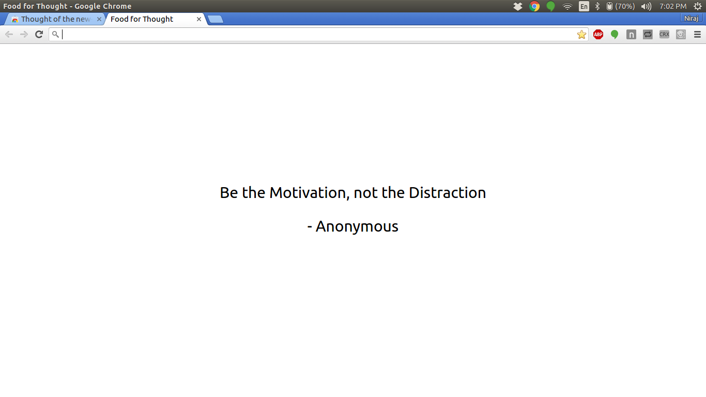

# Thought of the new-tab
> Provides thoughts every time a new tab opens.

A really minimal and simple ( like totally beginner level :P ) chrome extension that implements `thoughts` [library](https://github.com/nirajpandkar/thought-of-the-day).

Had to [browserify](http://browserify.org/) `background.js` into `bundle.js` to require `thoughts` module and add support for browser.

Find the extension here - https://chrome.google.com/webstore/detail/thought-of-the-new-tab/kglckaankcegmnohfnpgolmhnapnjjkn

# Licence

MIT © [Niraj Pandkar](https://github.com/nirajpandkar)
